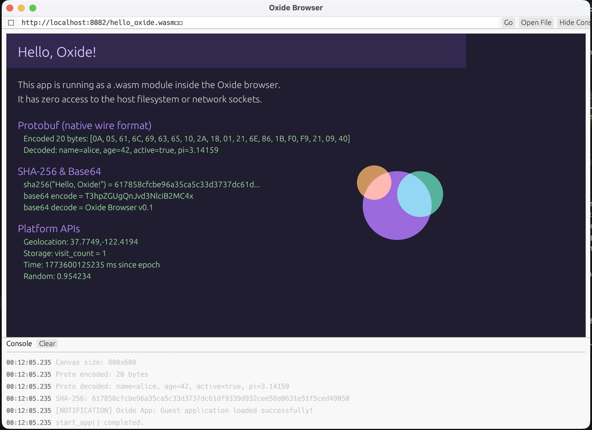

# Oxide — A Binary-First Browser

Oxide is a proof-of-concept browser that fetches and executes `.wasm` (WebAssembly) modules instead of HTML/JavaScript. Guest applications run in a secure, sandboxed environment with capability-based access to host APIs.



## Quick Start

```bash
# Install the wasm target
rustup target add wasm32-unknown-unknown

# Build and run the browser
cargo run -p oxide-browser

# Build the example guest app
cargo build --target wasm32-unknown-unknown --release -p hello-oxide

# In the browser, click "Open File" and select:
# target/wasm32-unknown-unknown/release/hello_oxide.wasm
```

## Core Stack

| Component   | Crate      | Purpose |
|-------------|------------|---------|
| Runtime     | `wasmtime` | WASM execution with fuel metering and memory limits |
| Networking  | `reqwest`  | Fetch `.wasm` binaries from URLs |
| Async       | `tokio`    | Async runtime for network operations |
| UI          | `egui` / `eframe` | URL bar, canvas renderer, console panel |
| File Picker | `rfd`      | Native OS file dialogs |
| Clipboard   | `arboard`  | System clipboard access |

## Security

- Zero filesystem access for guest modules
- Zero environment variable access
- Zero network socket access
- 16 MB memory limit (configurable)
- 500M instruction fuel limit (prevents infinite loops)

## Documentation

See [DOCS.md](DOCS.md) for the full developer guide, API reference, and instructions for building WASM websites.
