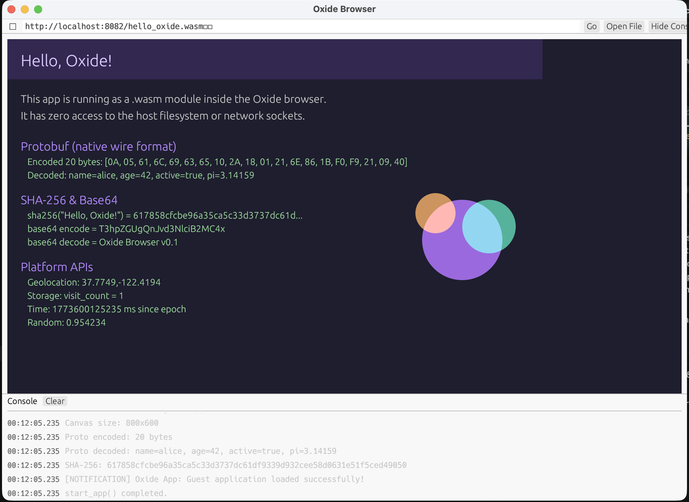

# Oxide — A Binary-First Browser

[](https://github.com/niklabh/oxide/releases)
[](https://crates.io/crates/oxide-sdk)
[](https://github.com/niklabh/oxide/blob/main/LICENSE)
[](https://docs.rs/oxide-sdk)
[](https://github.com/niklabh/oxide/actions/workflows/ci.yml)

Oxide is a **binary-first browser**: it fetches and runs `.wasm` (WebAssembly) modules instead of HTML, CSS, and JavaScript. Guest apps are Rust libraries compiled to `wasm32-unknown-unknown`, linked against [`oxide-sdk`](https://crates.io/crates/oxide-sdk), and executed in a **capability-based sandbox** — no filesystem, no environment variables, no raw sockets. Every interaction with the host (canvas, HTTP, audio, WebRTC, GPU, …) goes through explicit, opt-in host APIs registered in a wasmtime linker.

The desktop shell is built on [GPUI](https://www.gpui.rs/) (Zed's GPU-accelerated UI framework). Guest draw commands map directly onto GPUI primitives, so canvas output gets full hardware acceleration without a DOM or layout engine.

**[Oxide Forge](./oxide-forge.md)** is an AI-native layer inside the browser where Claude writes, compiles, and hot-loads guest `.wasm` apps. Open `oxide://forge`, describe what you want, watch it run. See the [Oxide Forge](./oxide-forge.md) and the [Forge Kit](./forge/README.md).



### Demo

<video src="https://oxide.foundation/assets/oxide-demo.mp4" poster="screens/oxide.png" controls width="100%"></video>

## Table of contents

- [Why Oxide?](#why-oxide)
- [Quick start](#quick-start)
- [Build a guest app](#build-a-guest-app)
- [Loading modules](#loading-modules)
- [Example apps](#example-apps)
- [Architecture](#architecture)
- [Host–guest boundary](#hostguest-boundary)
- [Rendering model](#rendering-model)
- [Security model](#security-model)
- [Core stack](#core-stack)
- [Oxide Forge](#oxide-forge--ai-native-app-generation)
- [Documentation](#documentation)
- [Contributing](#contributing)
- [License](#license)

## Why Oxide?

| Traditional browser | Oxide |
|---------------------|-------|
| HTML + CSS + JS parsed at runtime | Single `.wasm` binary compiled ahead of time |
| Implicit access to DOM, storage, network | Zero capabilities by default; host APIs are explicit |
| Layout engine + style cascade | Immediate-mode canvas — you place every pixel |
| Large attack surface (extensions, plugins) | No WASI; sandbox is airtight by construction |

Oxide is aimed at developers who want **Rust end-to-end** (guest UI + optional native backend), **predictable performance** (no JIT for app logic), and **strong isolation** for untrusted or user-generated modules — while still offering rich capabilities (video, WebRTC, GPU, MIDI, file picker) when the host grants them.

## Quick start

### Prerequisites

- **Rust** (stable, 1.75+): [rustup.rs](https://rustup.rs)
- **`wasm32-unknown-unknown`** target (for guest apps)
- **FFmpeg** dev libraries (for video decode in the host): `brew install ffmpeg` on macOS; on Debian/Ubuntu see [CONTRIBUTING.md](./CONTRIBUTING.md#prerequisites)

```bash
rustup target add wasm32-unknown-unknown
```

### Run the browser

```bash
git clone https://github.com/niklabh/oxide.git
cd oxide

cargo run -p oxide-browser
# or: cargo build --release -p oxide-browser && ./target/release/oxide-browser
```

### Run the hello-world guest

```bash
cargo build --target wasm32-unknown-unknown --release -p hello-oxide
```

In the browser: click **Open** and select  
`target/wasm32-unknown-unknown/release/hello_oxide.wasm`,  
or enter a hosted URL (e.g. from [oxide.foundation](https://oxide.foundation)) in the address bar.

Internal pages use the `oxide://` scheme: `oxide://home`, `oxide://history`, `oxide://bookmarks`, `oxide://about`, `oxide://forge`.

## Build a guest app

Guest apps are Rust `cdylib` crates. They **must** export `start_app()`; optionally export `on_frame(dt_ms: u32)` for interactive loops and `on_timer(callback_id: u32)` for timers.

```bash
cargo new --lib my-app && cd my-app
```

**`Cargo.toml`:**

```toml
[lib]
crate-type = ["cdylib"]

[dependencies]
oxide-sdk = "0.7"   # or path = "../oxide/oxide-sdk"
```

**`src/lib.rs` (minimal interactive app):**

```rust
use oxide_sdk::*;

#[no_mangle]
pub extern "C" fn start_app() {
    log("Hello from Oxide!");
}

#[no_mangle]
pub extern "C" fn on_frame(_dt_ms: u32) {
    canvas_clear(30, 30, 46, 255);
    canvas_text(20.0, 30.0, 24.0, 255, 255, 255, 255, "My Oxide App");
    if ui_button(1, 20.0, 70.0, 120.0, 30.0, "Click") {
        log("clicked!");
    }
}
```

```bash
cargo build --target wasm32-unknown-unknown --release
# → target/wasm32-unknown-unknown/release/my_app.wasm
```

For a higher-level drawing API, use `oxide_sdk::draw` (`Canvas`, `Color`, `Rect`, `Point2D`). Full API tables, WebSocket/WebRTC patterns, and protobuf fetch are in **[DOCS.md](./DOCS.md)**.

### Guest contract (checklist)

| Requirement | Detail |
|-------------|--------|
| Crate type | `[lib] crate-type = ["cdylib"]` |
| Target | `wasm32-unknown-unknown` |
| Entry | Export `start_app()` — called once on load |
| Frame loop | Optional `on_frame(dt_ms: u32)` — called every frame; fuel replenished each call |
| Timers | Optional `on_timer(callback_id: u32)` — for `set_timeout` / `set_interval` |
| Imports | Only from the `"oxide"` WASM import module (via `oxide-sdk`) — **never WASI** |
| Memory | All strings/bytes cross the FFI as `(ptr, len)` into linear memory |

## Loading modules

| Method | How |
|--------|-----|
| **Local file** | Toolbar **Open** → pick `.wasm` (max 50 MB) |
| **HTTP(S)** | Enter URL in the address bar; host fetches bytes and compiles |
| **`file://`** | Open a local path to a `.wasm` file |
| **`oxide://`** | Built-in pages (home, history, forge, …) — no guest module |
| **Child module** | Guest calls `load_module(url)` for an isolated sub-sandbox |

Pipeline: **fetch bytes → compile (wasmtime) → link host functions → instantiate → `start_app()` → `on_frame` loop**. Load runs on a background thread; the GPUI shell talks to the runtime over channels.

## Example apps

Build any example with `cargo build --target wasm32-unknown-unknown --release -p <name>`.

| Crate | What it demonstrates |
|-------|----------------------|
| [`hello-oxide`](./examples/hello-oxide/) | Widgets, input, frame loop |
| [`index`](./examples/index/) | Demo hub — links to hosted `.wasm` samples |
| [`audio-player`](./examples/audio-player/) | Decode and play audio |
| [`video-player`](./examples/video-player/) | FFmpeg video, subtitles, PiP, HLS |
| [`media-capture`](./examples/media-capture/) | Camera, microphone, screen capture |
| [`gpu-graphics-demo`](./examples/gpu-graphics-demo/) | WebGPU-style buffers, shaders, compute |
| [`rtc-chat`](./examples/rtc-chat/) | WebRTC P2P chat |
| [`ws-chat`](./examples/ws-chat/) | WebSocket chat |
| [`stream-fetch-demo`](./examples/stream-fetch-demo/) | Streaming HTTP fetch |
| [`timer-demo`](./examples/timer-demo/) | `set_timeout` / `set_interval` |
| [`raf-demo`](./examples/raf-demo/) | `request_animation_frame` |
| [`midi-demo`](./examples/midi-demo/) | MIDI input visualizer |
| [`events-demo`](./examples/events-demo/) | Custom event listeners |
| [`file-picker-demo`](./examples/file-picker-demo/) | Native file/folder picker and I/O |
| [`gradient-demo`](./examples/gradient-demo/) | Canvas gradients |
| [`typography-demo`](./examples/typography-demo/) | `canvas_text_ex`, fonts, alignment |
| [`fullstack-notes`](./examples/fullstack-notes/) | Rust WASM frontend + native backend |

Open **`index`** in the browser for a visual catalog, or run `cargo run -p oxide-browser` and navigate to hosted demos on [oxide.foundation](https://oxide.foundation).

## Architecture

```
┌──────────────────────────────────────────────────────────────────┐
│                        Oxide Browser                             │
│                                                                  │
│  ┌──────────┐  ┌────────────────────────┐  ┌─────────────────┐   │
│  │  URL Bar │  │        Canvas          │  │     Console     │   │
│  └────┬─────┘  └───────────┬────────────┘  └────────┬────────┘   │
│       │                    │                        │            │
│  ┌────▼────────────────────▼────────────────────────▼─────────┐  │
│  │                    Host Runtime                            │  │
│  │  wasmtime engine  ·  fuel metering  ·  bounded memory      │  │
│  └────────────────────────────┬───────────────────────────────┘  │
│                               │                                  │
│  ┌────────────────────────────▼───────────────────────────────┐  │
│  │                  Capability Layer                          │  │
│  │  "oxide" import module — ~150 host functions               │  │
│  │  canvas · gpu · audio · video · capture · fetch · streaming│  │
│  │  websocket · webrtc · midi · timers · animation frames     │  │
│  │  console · storage · clipboard · widgets · crypto · ...    │  │
│  └────────────────────────────┬───────────────────────────────┘  │
│                               │                                  │
│  ┌────────────────────────────▼───────────────────────────────┐  │
│  │                  Guest .wasm Module                        │  │
│  │  exports: start_app(), on_frame(dt)                        │  │
│  │  imports: oxide::*  (via oxide-sdk)                        │  │
│  └────────────────────────────────────────────────────────────┘  │
└──────────────────────────────────────────────────────────────────┘
```

### Project structure

```
oxide/
├── oxide-browser/           # Host browser (wasmtime + GPUI)
│   └── src/
│       ├── engine.rs        # WasmEngine, SandboxPolicy, compile & memory bounds
│       ├── runtime.rs       # BrowserHost — fetch, load, instantiate, frame loop
│       ├── capabilities.rs  # Host functions registered into the wasmtime Linker
│       ├── forge.rs         # oxide://forge — Claude streaming + cargo driver
│       ├── forge_config.rs  # Forge paths, model, env configuration
│       ├── navigation.rs    # History stack, back/forward
│       ├── url.rs           # URL parser (http, https, file, oxide)
│       ├── rtc.rs, websocket.rs, gpu.rs, video.rs, …
│       └── ui.rs            # GPUI shell — toolbar, canvas, console, widgets
├── oxide-sdk/               # Guest SDK (no_std-friendly FFI wrappers)
│   └── src/
│       ├── lib.rs           # Safe wrappers over host imports
│       ├── draw.rs          # High-level Canvas / Color / Rect API
│       └── proto.rs         # Zero-dependency protobuf codec
├── forge/                   # Forge kit — prompts, catalog, recipes, templates
├── examples/                # Guest demo apps (see table above)
├── DOCS.md                  # Full developer guide & API reference
└── ROADMAP.md               # Planned features
```

### Module loading pipeline

```
 ┌───────────────┐     ┌──────────────┐     ┌──────────────────┐
 │  Fetch bytes  │────▶│   Compile    │────▶│  Link host fns   │
 │  (HTTP/file)  │     │  (wasmtime)  │     │  + bounded mem   │
 └───────────────┘     └──────────────┘     └────────┬─────────┘
                                                     │
 ┌───────────────┐     ┌──────────────┐     ┌────────▼─────────┐
 │  Frame loop   │◀────│  start_app() │◀────│   Instantiate    │
 │  (on_frame)   │     │  entry call  │     │   wasm module    │
 └───────────────┘     └──────────────┘     └──────────────────┘
```

1. **Fetch** — download `.wasm` via HTTP or read a local file (max 50 MB).
2. **Compile** — `WasmEngine` + `SandboxPolicy` (fuel and memory bounds).
3. **Link** — register all `oxide::*` imports; bounded linear memory (4096 pages / 256 MB max).
4. **Instantiate** — `HostState` holds canvas commands, console, input, storage, widgets.
5. **`start_app()`** — guest entry runs once.
6. **`on_frame(dt_ms)`** — optional per-frame callback; fuel replenished each frame (50M instructions).

## Host–guest boundary

Guest modules start with **zero capabilities**. All host access is under the `"oxide"` WASM import namespace:

| Category | Host functions (representative) |
|----------|--------------------------------|
| **Canvas** | `clear`, `rect`, `circle`, `text`, `text_ex`, `measure_text`, `line`, `image`, scroll/virtual size; plus `oxide_sdk::draw` |
| **GPU** | buffers, textures, WGSL shaders, render/compute pipelines, `gpu_draw`, `gpu_dispatch_compute` |
| **UI widgets** | `button`, `checkbox`, `slider`, `text_input` (immediate-mode) |
| **Console** | `log`, `warn`, `error` |
| **Input** | mouse position/buttons, keys, scroll delta, modifiers |
| **Storage** | session `storage_*`, persistent `kv_store_*` (sled-backed, per-origin) |
| **File I/O** | `file_pick`, `folder_pick`, `folder_entries`, `file_read`, `file_read_range` |
| **Events** | `on_event`, `off_event`, `emit_event` |
| **Download / PDF** | `download_data`, `download_url`, `canvas_print_pdf` |
| **HTTP** | `fetch`, `fetch_get/post/…`, `fetch_post_proto`, streaming `fetch_begin/recv/…` |
| **WebSocket** | connect, send/recv text/binary, ready state, close |
| **WebRTC** | peer connection, SDP, ICE, data channels, media tracks |
| **Audio / video** | playback, seek, HLS, subtitles; FFmpeg-backed decode |
| **Media capture** | camera, microphone, screen |
| **MIDI** | device enumeration, open, send, recv |
| **Timers** | `set_timeout`, `set_interval`, `request_animation_frame` |
| **Navigation** | `navigate`, history, `get_url`, hyperlinks on canvas |
| **Crypto** | SHA-256, Base64 |
| **Clipboard** | read, write |
| **Dynamic loading** | `load_module` — child `.wasm` with isolated memory and fuel |

Data crosses the boundary through linear memory: `(ptr, len)` pairs; helpers `read_guest_string` / `write_guest_bytes` on the host side. See [`CAPABILITIES.md`](./forge/skills/oxide-wasm-app/references/CAPABILITIES.md) for the full generated catalog used by Forge.

## Rendering model

Oxide uses **immediate-mode rendering** — no DOM, no retained scene graph:

1. Each frame, the guest issues draw commands (`canvas_clear`, `canvas_rect`, …) into a command queue on the host.
2. Widget calls (`ui_button`, …) enqueue overlay widgets.
3. `ui.rs` drains both queues and paints with GPUI (`paint_quad`, `paint_path`, `paint_image`, GPU text shaping).
4. Images decode once and cache as `RenderImage` textures (same path for video frames).
5. Interaction state flows back on the next `on_frame` via `widget_clicked`, mouse/key polling, etc.

The guest decides layout, styling, and hit targets explicitly.

## Security model

| Constraint | Value | Purpose |
|------------|-------|---------|
| Filesystem access | **None** | Guest cannot touch host files directly |
| Environment variables | **None** | Guest cannot read host env |
| Network sockets | **None** | All HTTP/WebSocket/WebRTC mediated by host |
| Memory ceiling | 256 MB (4096 pages) | Prevents memory exhaustion |
| Fuel budget | 500M instructions/call | Prevents infinite loops and DoS |

Security is **additive**: nothing is granted by default. File access uses a native picker; HTTP uses host `reqwest`; child modules get separate memory and fuel. **No WASI** is linked.

## Core stack

| Component | Crate / library | Role |
|-----------|-----------------|------|
| Runtime | `wasmtime` | WASM execution, fuel, memory limits |
| Networking | `reqwest`, `tokio-tungstenite` | HTTP, streaming fetch, WebSocket |
| Async | `tokio` | Background load, network, RTC |
| UI | [GPUI](https://www.gpui.rs/) | Native shell, GPU canvas |
| Storage | `sled` | Persistent KV per origin |
| File picker | `rfd` | Native dialogs |
| Clipboard | `arboard` | System clipboard |
| Imaging | `image` | PNG/JPEG/GIF/WebP for canvas |
| Video | `ffmpeg-next` | Decode, HLS, subtitles, PiP |
| Audio | `rodio` | Multi-channel playback |
| Capture | `nokhwa`, `cpal`, `screenshots` | Camera, mic, screen |
| GPU | `wgpu` | Guest WebGPU-style API |
| WebRTC | `webrtc` | P2P, data channels, tracks |
| MIDI | `coremidi` (macOS) | MIDI I/O |
| Crypto | `sha2` | SHA-256 for guests |

## Oxide Forge — AI-native app generation

`oxide://forge` turns natural-language prompts into compiled guest `.wasm` modules running in the same browser.

### Flow

```
 ┌───────────────────┐    ┌────────────────┐   ┌──────────────────┐
 │  prompt / revise  │───▶│  Claude stream │──▶│  write lib.rs    │
 │  (oxide://forge)  │    │  (Messages API)│   │  to chosen dir   │
 └───────────────────┘    └────────────────┘   └────────┬─────────┘
                                                        │
 ┌───────────────────┐    ┌────────────────┐   ┌────────▼─────────┐
 │  "Run" → new tab  │◀───│  load .wasm    │◀──│  cargo build     │
 │  sandboxed        │    │  into BrowserHost │  wasm32-unknown  │
 └───────────────────┘    └────────────────┘   └──────────────────┘
```

Forge lists every creation; select one and prompt again to **revise** — it sends the current `src/lib.rs` to Claude, rebuilds, and copies `<slug>.wasm` into the project folder. On compile failure, Forge feeds compiler output back to Claude up to **3 times** before surfacing the error.

### Under the hood

| Piece | Location |
|-------|----------|
| Prompt kit (system prompt, SDK catalog, recipes, patterns) | [`forge/`](./forge/) |
| Session state, Claude streaming, cargo driver, self-debug | [`oxide-browser/src/forge.rs`](./oxide-browser/src/forge.rs) |
| `oxide://forge` UI | [`oxide-browser/src/ui.rs`](./oxide-browser/src/ui.rs) |
| Base Cargo template per session | [`forge/templates/base/`](./forge/templates/base/) |

Generation follows the [`oxide-wasm-app`](./forge/skills/oxide-wasm-app/SKILL.md) Agent Skill, constrained to the same sandbox as hand-written guests. The Forge **build step runs host `cargo`** — that is intentional developer tooling, not guest code.

### Try Forge

```bash
export ANTHROPIC_API_KEY=sk-ant-…
cargo run -p oxide-browser
# URL bar → oxide://forge → type a prompt → Enter
```

| Variable | Purpose |
|----------|---------|
| `ANTHROPIC_API_KEY` | Required for Claude API |
| `OXIDE_FORGE_DIR` | Output directory for generated projects (default: `target/forge/`) |
| `OXIDE_FORGE_MODEL` | Override default model (`claude-opus-4-7`) |

Use **Choose folder** in the Forge UI to pick a persistent projects directory. Curated demo prompts: [`forge/DEMO_PROMPTS.md`](./forge/DEMO_PROMPTS.md).

## Documentation

| Resource | Description |
|----------|-------------|
| **[DOCS.md](./DOCS.md)** | Full developer guide, API reference, hosting WASM on the web |
| **[docs.rs/oxide-sdk](https://docs.rs/oxide-sdk)** | Rust API docs for the guest SDK |
| **[CONTRIBUTING.md](./CONTRIBUTING.md)** | Dev setup, adding host functions, PR process |
| **[ROADMAP.md](./ROADMAP.md)** | Planned features and milestones |
| **[forge/README.md](./forge/README.md)** | Forge kit for AI agents |
| **[SECURITY.md](./SECURITY.md)** | Security reporting |
| **[oxide-forge.md](./oxide-forge.md)** | Forge hackathon / design notes |

**Workspace checks** (before committing):

```bash
cargo fmt --all
cargo clippy --workspace --all-targets -- -D warnings
cargo test --workspace
```

## Contributing

Contributions welcome — host capabilities, SDK wrappers, examples, docs, and Forge prompts. See **[CONTRIBUTING.md](./CONTRIBUTING.md)** for the host-function checklist, coding guidelines, and issue labels. Join discussions on [GitHub Issues](https://github.com/niklabh/oxide/issues).

## License

Apache-2.0 — see [LICENSE](./LICENSE).
